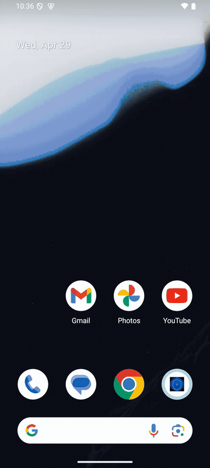
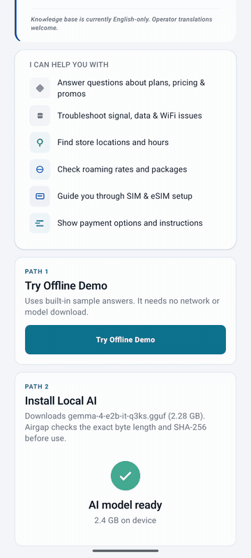
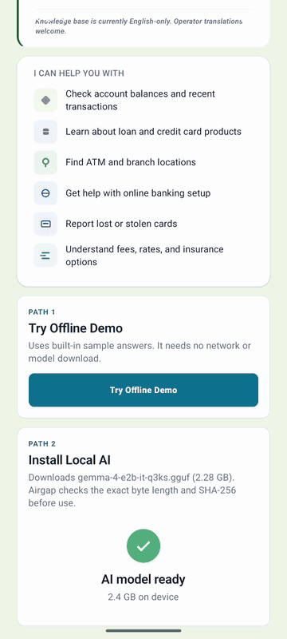
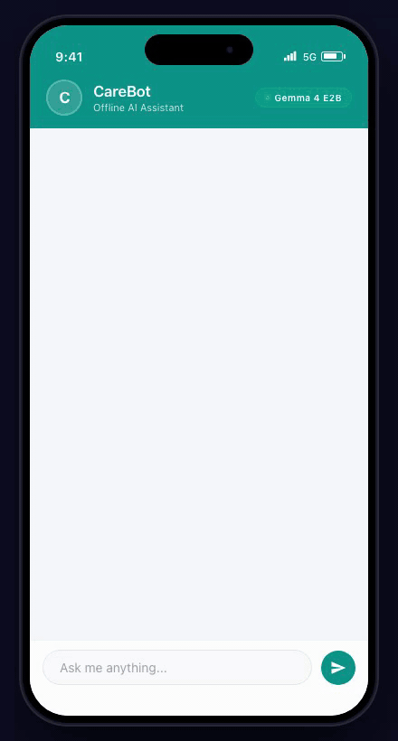
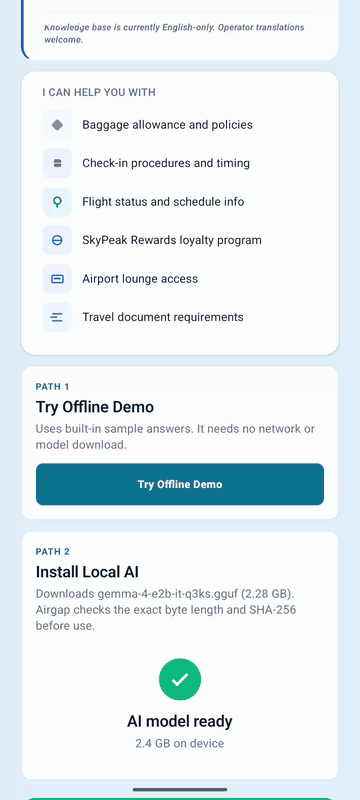
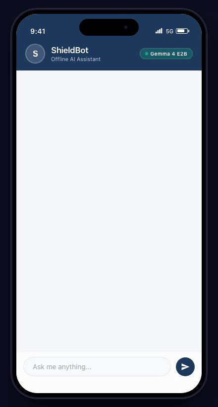
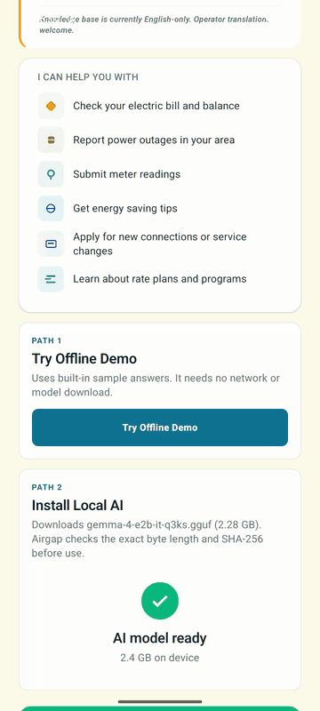
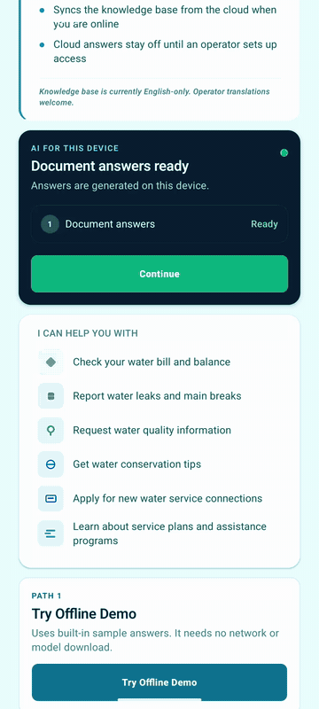
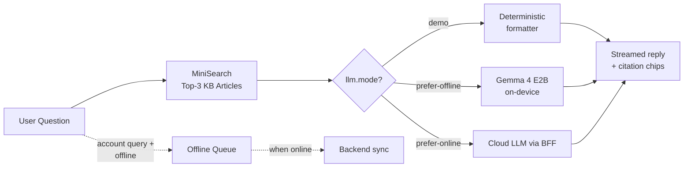

<p align="center">
  
</p>

<h1 align="center">Airgap</h1>

<p align="center">
  <strong>Air-gapped AI support for enterprise. On-device. Offline-first. Config-driven.</strong>
</p>

<p align="center">
  
  
  
  
  
  
  
  
  
  <a href="https://xmpuspus.github.io/airgap/"></a>
</p>

<p align="center">
  An MIT-licensed React Native framework for shipping a config-driven, on-device customer support bot. Seven industry templates ship in this repo. Pick one, edit one JSON file, deploy.
</p>

<div align="center">
<table>
<tr>
<td align="center" valign="top" width="50%">
<br/>

<br/><br/>

<br/>
<sub>Android emulator, API 36</sub>
</td>
<td align="center" valign="top" width="50%">
<br/>

<br/><br/>

<br/>
<sub>iOS simulator, iPhone 17 Pro</sub>
</td>
</tr>
</table>
</div>

---

## Three commands to a working app

A fresh clone ships in **demo mode**: no model download, no cloud calls. The chat formats top-K KB hits as a streamed reply, so a fresh emulator launch reaches the chat screen in under five minutes.

```bash
git clone https://github.com/xmpuspus/airgap.git
cd airgap && npm install
npx react-native run-android
```

A teal "Demo mode" banner appears at the top of the chat. Sending "What plans do you have?" returns a streamed answer pulled directly from the indexed KB. Switch any of the seven industry configs in via `examples/<industry>/airgap.config.json` and the same query returns the right answer for that vertical.

To switch to real on-device inference, open `airgap.config.json`, change `llm.mode` from `"demo"` to `"prefer-offline"`, then download the model via `./scripts/pull-dev-model.sh` (or trigger the in-app onboarding download). Branding is a separate step: `./scripts/setup.sh` is an interactive wizard for company name, colors, hotline, and native package id.

### Prerequisites

| Tool | Version | Install |
|------|---------|---------|
| Node.js | >= 22.11 | [nodejs.org](https://nodejs.org/) |
| Watchman | latest | `brew install watchman` |
| JDK | 17 | `brew install openjdk@17` |
| Android SDK | 36 | [Android Studio](https://developer.android.com/studio) |
| Xcode | 26+ | App Store |
| CocoaPods | latest | `gem install cocoapods` |

### iOS

```bash
cd ios && pod install && cd ..
npx react-native run-ios
```

Demo mode runs on the iPhone simulator. Real on-device LLM inference is not yet supported on iOS simulators because llama.rn's Metal path requires a physical device.

---

## What ships in the box

- **Demo mode by default.** A vertical-agnostic formatter streams top-K KB hits with simulated thinking pauses. No model download, no cloud calls, no telco-specific code path. Same component handles every industry.
- **On-device Gemma 4 E2B** when you flip `llm.mode`. ~2.4 GB Q3_K_S GGUF, <1.5 GB runtime RAM, 128K context. Fully offline.
- **Citation chips and source drawer.** Every grounded answer surfaces up to three `category > title` chips below the bubble. Tap a chip to read the full KB doc that grounded the answer. Helpful for trust signals after the *Moffatt v. Air Canada* precedent.
- **Seven industry templates** (telecom, banking, healthcare, airline, insurance, electric utility, water utility). Real KBs (~40 to ~118 docs each), real tool definitions, real safety policies.
- **Offline-first sync.** State-changing actions queue in encrypted MMKV when offline, replay against your BFF when online. Knowledge-base updates push from a remote manifest on a cadence you control.
- **Tooling without surprises.** Setup wizard, KB validator, CSV importer, interactive `npm run kb:studio` walk-through, device benchmark harness, deterministic safety layer.

## Industry templates

| Industry | Bot | KB entries | Template | Demo |
|----------|-----|-----------|----------|:----:|
| Telecom | Alice | 118 | [`telco/`](examples/telco/) |  |
| Banking | PrimaAssist | 62 | [`banking/`](examples/banking/) |  |
| Healthcare | CareBot | 50 | [`healthcare/`](examples/healthcare/) |  |
| Airline | SkyBot | 54 | [`airline/`](examples/airline/) |  |
| Insurance | ShieldBot | 47 | [`insurance/`](examples/insurance/) |  |
| Electric utility | PowerBot | 53 | [`electric-utility/`](examples/electric-utility/) |  |
| Water utility | AquaBot | 36 | [`water-utility/`](examples/water-utility/) |  |

The live showcase at [xmpuspus.github.io/airgap](https://xmpuspus.github.io/airgap/) lets you flip across all seven verticals from a single page: brand metadata, theme, condensed config, framed real recording. The chat is the actual emulator capture, not an HTML mockup.

```bash
# Switch to a different template manually
cp examples/banking/airgap.config.json airgap.config.json
cp examples/banking/knowledge/*.json src/knowledge/
node scripts/generate-manifest.js && npx react-native run-android
```

Or use the wizard: `./scripts/setup.sh` and pick from the menu.

---

## Architecture



One code path. No intent classifier, no template engine. Citation chips read from the same `audit.kbDocIds` the safety layer uses for grounding.

### Key files

| File | Purpose |
|------|---------|
| `airgap.config.json` | Single source of truth: brand, theme, model, prompts, privacy, safety, tools |
| `airgap.schema.json` | Formal JSON Schema for the config |
| `src/services/orchestrator.ts` | Central pipeline: blocklist, tool router, search, LLM route, validation, history |
| `src/services/llmRouter.ts` | Picks demo, on-device, or cloud based on `llm.mode` and connectivity |
| `src/services/searchService.ts` | MiniSearch with category boosting, negation filtering, re-ranking |
| `src/services/safetyLayer.ts` | Topic blocklist, grounding rules, refusal templates |
| `src/components/chat/CitationChips.tsx` | Tappable `category > title` chips below grounded bubbles |
| `src/components/chat/SourceDrawer.tsx` | Bottom-sheet drawer with full KB doc on chip tap |
| `examples/<industry>/` | Seven full templates: config + knowledge + ENTERPRISE notes |

---

## Benchmarks

The benchmark harness lives under [`bench/`](bench/). Reproduce locally with `bash bench/run-node.sh` (quick node check, demo path), `bash bench/run-android.sh` for a Pixel-class device or emulator, or `bash bench/run-ios.sh` for the iPhone simulator. Each run drops a JSON file into `bench/results/`, and `node bench/render-table.mjs` folds it into the table below. New device rows are welcome: open a PR adding your `bench/results/<device>-<date>.json`.

<!-- BENCH:START -->
| Device | Mode | Model | First-token (p50 ms) | Tokens/sec (p50) | Cold load (ms) | Notes |
| --- | --- | --- | --- | --- | --- | --- |
| mac-host-gemma3-fixture | real | hf_bartowski_google_gemma-3-1b-it-Q4_K_M.gguf | 29 | 84.5 | 610.8 | fixture (Gemma 3 1B Q4), not Gemma 4 |
| mac-host-node | demo | gemma-4-e2b-it-q3ks.gguf | 0.6 | n/a (demo) | n/a |  |
<!-- BENCH:END -->

Columns: Device is the hardware identifier. Mode is `real` for on-device LLM and `demo` for the deterministic formatter path. First-token p50 is the median time from request to the first emitted token. Tokens/sec p50 is steady-state throughput during generation. Cold load is the one-time model load cost. Notes captures device RAM, OS build, or any tweak that changes the result.

See [`bench/README.md`](bench/README.md) for the harness end-to-end.

---

## Gemma 4 E2B, honest numbers

Default model is Gemma 4 E2B Q3_K_S, ~2.4 GB GGUF, downloaded on first launch from `unsloth/gemma-4-E2B-it-GGUF`. Numbers below are from Google's published model card for the **E2B variant only**, not the larger E4B/26B/31B tiers.

| Benchmark | E2B score | What it measures |
|---|---|---|
| MMLU | 60.0% | General knowledge |
| MMLU Pro | 44.2% | Harder reasoning |
| AIME 2026 | 37.5% | Math word problems |
| LiveCodeBench | 44.0% | Code generation |
| **τ2-bench (Retail)** | **24.5** | **Customer-support agent** |
| Runtime RAM | ~1.5 GB | Memory-mapped, per-layer PLE |

Source: [Google Gemma 4 model card](https://ai.google.dev/gemma/docs/core/model_card_4).

E2B scores 24.5 on τ2-bench (Retail), which is to say it fails roughly three out of four multi-step retail support scenarios at face value. Airgap mitigates this in three ways:

1. **KB grounding.** Every answer survives a grounding check against retrieved KB documents. Unsourced amounts and dates are rejected by the safety layer before they reach the user. See [`docs/safety-layer.md`](docs/safety-layer.md).
2. **Deterministic tool routing.** State-changing actions (balance lookup, ticket creation, appointment booking) go through a config-defined tool router, not the LLM. The LLM only paraphrases the structured tool result. See [`docs/tool-calling.md`](docs/tool-calling.md).
3. **Optional hybrid cloud fallback.** Operators who need stronger agentic behavior flip `llm.mode` to `prefer-online` and route harder queries to a cloud model via the BFF. On-device handles disconnection minutes; cloud handles the long tail. See [`docs/hybrid-llm-design.md`](docs/hybrid-llm-design.md).

Airgap is positioned as offline-resilient, sync-capable on-device customer support, not as a standalone agent framework. For scenarios that need a real multi-turn retail agent, run E4B+ or a cloud model via the hybrid path. The same tool definitions work on all three targets.

---

## Customization

### Spin up your own

```bash
npx create-airgap-bot my-bot --template telco
```

Fastest path. The `create-airgap-bot` scaffolder fetches this repo, drops in the chosen industry config and knowledge base, and renames the React Native target across `package.json`, `app.json`, the Android Gradle module, the iOS workspace, and `Info.plist`. Native signing keys are not regenerated; run `./scripts/setup.sh` afterwards if you need branding tweaks beyond the rename. The package lives at [`packages/create-airgap-bot/`](packages/create-airgap-bot/) and is currently being prepared for publish to npm.

### One-shot setup

```bash
./scripts/setup.sh
```

Interactive wizard. Prompts for company name, bot name, industry template, brand color, hotline, website. Updates `airgap.config.json`, `app.json`, the Android package id, the iOS target, and copies the chosen industry KB into place.

### Manual configuration

`airgap.config.json` is the only file that needs to change for branding and content. The full schema is in [`airgap.schema.json`](airgap.schema.json), and [CUSTOMIZATION.md](CUSTOMIZATION.md) walks every section.

```json
{
  "brand": {
    "name": "Your Company",
    "botName": "YourBot",
    "tagline": "Always here to help",
    "hotline": "1-800-HELP"
  },
  "theme": {
    "primary": "#0047AB",
    "secondary": "#FF6B00",
    "background": "#F5F7FA",
    "darkMode": "auto"
  },
  "privacy": {
    "dataRetentionDays": 90,
    "allowExport": true,
    "allowDeleteData": true,
    "privacyPolicyUrl": "https://yourcompany.com/privacy"
  },
  "llm": {
    "mode": "demo"
  }
}
```

### Knowledge base authoring

Three entry points, all sharing the same parser and validator under `scripts/lib/kb.js`:

```bash
npm run kb:validate                      # Schema check on src/knowledge/
npm run kb:import path/to/data.csv       # CSV to kbdoc-v1 JSON
npm run kb:studio                        # Interactive walk-through
```

The interactive studio (see [`docs/kb-studio.md`](docs/kb-studio.md)) walks an operator from a CSV through schema validation, MiniSearch top-K preview, export to a chosen industry's knowledge dir, and finally chains into the per-industry journey suite. Built on Node's built-in readline, no extra deps.

<p align="center">
  
</p>

The recording above was captured with [`vhs`](https://github.com/charmbracelet/vhs); reproduce with `vhs demo/kb-studio.tape`.

The kbdoc-v1 schema is short:

```json
{
  "id": "faq-billing-cycle",
  "category": "faq",
  "title": "When is my billing cycle?",
  "content": "Bills are generated on the 3rd of each month...",
  "keywords": ["billing", "cycle", "due date"],
  "tags": ["billing", "account"]
}
```

Search tuning lives in `airgap.config.json` under `knowledge.search`: `topK`, `fuzzy`, and per-field boosts (`boostKeywords` defaults to 3 because keywords are curated, `boostTitle` 2, `boostContent` 1).

### Backend connector

The default `MockBackendConnector` returns demo data. For production, implement `RestBackendConnector` and point `airgap.config.json` `backend.baseUrl` at your BFF. The BFF pattern lets you bridge industry-standard APIs without exposing them to the device:

| Industry | Backend systems | Standard APIs |
|----------|----------------|---------------|
| Telecom | Amdocs, CSG, Ericsson BSS | [TM Forum Open APIs](https://www.tmforum.org/oda/open-apis/) |
| Banking | Temenos, FIS, Finastra | [Open Banking](https://www.openbanking.org.uk/), ISO 20022 |
| Healthcare | Epic, Cerner, Allscripts | [HL7 FHIR](https://www.hl7.org/fhir/) |
| Airline | Amadeus, Sabre, SITA | [IATA NDC](https://www.iata.org/en/programs/airline-retailing/ndc/) |
| Insurance | Guidewire, Duck Creek | [ACORD](https://www.acord.org/) |
| Utilities | SAP IS-U, Oracle Utilities | [IEEE 2030.5](https://standards.ieee.org/ieee/2030.5/5897/), MultiSpeak |

### Pick your model

| Model | Size | RAM | Use case |
|-------|------|-----|----------|
| Gemma 4 E2B Q3_K_S | 2.4 GB | <1.5 GB | Production, flagship phones (default) |
| Gemma 4 E2B Q2_K | 1.8 GB | ~1.2 GB | Budget devices, 3 GB RAM phones |
| Qwen 2.5 0.5B Q4 | 469 MB | ~600 MB | Ultra-low-end, fast inference |
| SmolLM 360M Q4 | 230 MB | ~400 MB | Proof-of-concept, IoT |

Edit the `model` block in `airgap.config.json` to swap. SHA256 verification is supported via the `sha256` field. Self-host the GGUF on your own CDN by changing `url`.

---

## Testing

Layered test suite. Unit tests run in CI, journey runners run locally against deterministic fixtures, the LLM journey runner requires a GGUF model.

```bash
npx jest                                 # 204 unit tests
node __tests__/run-journeys.mjs          # 100 single-turn journeys
node __tests__/run-multi-turn.mjs        # 70 multi-turn conversations
node __tests__/run-industry-tests.mjs    # 66 per-industry behaviors
npm run kb:validate                      # KB schema validation
node bench/render-table.mjs              # Refresh the bench table from results/
```

Layer breakdown: unit covers config loader, i18n, search service, safety layer, sync service, sync integration, tool router, golden coverage, adversarial coverage, demo formatter, citation chip resolver, bench harness, KB lib, render-table, web build. Journey runners exercise the search and routing pipeline end-to-end against fixtures. Industry tests assert per-vertical behavior.

The LLM journey runner (`run-llm-journeys.mjs`) is separate. Run it after fetching the real Gemma 4 E2B GGUF via `pull-dev-model.sh` and flipping `llm.mode` to a non-demo value. Note that `node-llama-cpp 3.18.1` does not yet understand the `gemma4` architecture, so the laptop runner currently uses a Gemma 3 1B Q4_K_M dev fixture for coverage and the real Gemma 4 E2B verification has to come from a physical device. The runner bakes the model filename into its JSON output so dev-fixture results can never be silently published as Gemma 4 numbers.

---

## Build and ship

### Android release APK

```bash
keytool -genkeypair -v -storetype PKCS12 \
  -keystore android/app/release.keystore \
  -alias release -keyalg RSA -keysize 2048 -validity 10000

# Set in android/gradle.properties
AIRGAP_RELEASE_STORE_FILE=release.keystore
AIRGAP_RELEASE_STORE_PASSWORD=...
AIRGAP_RELEASE_KEY_ALIAS=release
AIRGAP_RELEASE_KEY_PASSWORD=...

cd android && ./gradlew assembleRelease
# Output: android/app/build/outputs/apk/release/app-release.apk
```

### iOS release (TestFlight, App Store)

```bash
cd ios && pod install && cd ..
open ios/*.xcworkspace
# In Xcode: select Team in Signing, set Bundle Identifier,
# Product, Archive, Distribute App, App Store Connect
```

### Build matrix

| Setting | Android | iOS |
|---------|---------|-----|
| Min OS | SDK 24 (Android 7.0) | iOS 16+ |
| Target OS | SDK 36 (Android 15) | iOS 26 |
| JS engine | Hermes | Hermes |
| Architecture | New (Fabric) | New (Fabric) |
| Signing | PKCS12 keystore | Apple Developer certificates |

See [DEPLOYMENT.md](DEPLOYMENT.md) for the long-form release checklist.

---

## How Airgap compares

### vs on-device AI apps

| | Airgap | BastionChat | ToolNeuron | ChatterUI |
|---|---|---|---|---|
| On-device LLM | Gemma 4 E2B | Gemma 3 / Qwen 3 | GGUF models | GGUF models |
| Knowledge base + RAG | 420+ entries, BM25 | RAG search | RAG packs | No |
| Config-driven (no code) | JSON spec + schema | No | No | No |
| White-label / multi-brand | 7 templates | No | No | No |
| Enterprise backend | BackendConnector + BFF | No | No | No |
| Offline queue | Encrypted MMKV | No | No | No |
| Citation chips and drawer | Yes | No | No | No |
| Cross-platform | Android + iOS | Desktop / iOS | Android | Android |
| License | MIT | Proprietary | GPL-3.0 | AGPL-3.0 |

### vs cloud chatbot frameworks

| | Airgap | Rasa | Botpress | Dialogflow |
|---|---|---|---|---|
| Works offline | Fully air-gapped | No | No | No |
| On-device LLM | Gemma 4 on phone | Server-side | Cloud GPT | Cloud LLM |
| Data sovereignty | Never leaves device | Self-hosted | Cloud | Google Cloud |
| Per-query cost | Zero | Server hosting | Per-message | Per-request |
| Setup | Edit one JSON file | YAML + training | Visual builder | Cloud console |
| Open source | MIT | Dual license | Proprietary | Proprietary |

### vs on-device AI SDKs

| | Airgap | RunAnywhere (YC) | React Native AI | Cactus (YC) |
|---|---|---|---|---|
| What it is | Complete support bot | Inference SDK | LLM binding | Inference engine |
| Chat UI | Yes | No | No | No |
| Knowledge base | Yes (MiniSearch) | No | No | No |
| Orchestrator | Yes (routing, history) | No | No | No |
| Config-driven | JSON spec | Control plane | No | No |
| Citations | Chips + drawer | No | No | No |

The gap: SDKs give you the engine. Cloud frameworks give you the server. Airgap gives you the complete, deployable, air-gapped support bot that an enterprise can configure with one JSON file and ship.

---

## Why air-gapped

- Works in disconnection minutes: outages, transit, rural areas.
- Conversations never leave the device. GDPR, HIPAA, data residency by construction.
- Zero per-query cost. No API keys, no usage billing, no vendor lock-in.
- Simpler audit surface when data stays on-device.
- Runs in regulated industries: healthcare, defense, finance, education, government.

## Why open source

MIT for the framework. The runtime stack stays commercially permissive: [Gemma 4](https://ai.google.dev/gemma) weights are Apache 2.0, [llama.cpp](https://github.com/ggml-org/llama.cpp) is MIT, and Airgap itself is MIT. No proprietary layer is required.

- Inspect every line of orchestrator, prompt builder, and search logic.
- Zero telemetry. No analytics phone-home. No crash reporting to third parties.
- Fork, modify, deploy without permission or licensing fees.
- Switch models (Gemma, Llama, Phi, Qwen), platforms, or inference engines at will.

## License

MIT. Use it for anything, including commercial products, subject to the license notice.
