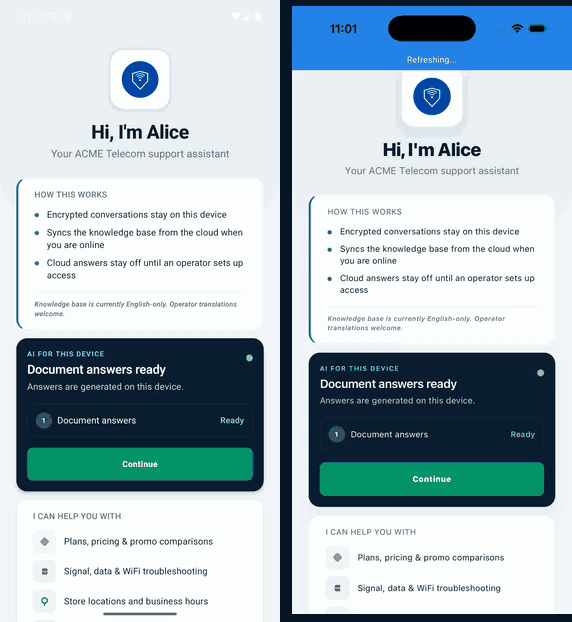
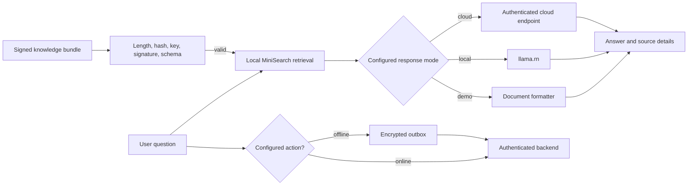

<p align="center">
  
</p>

<h1 align="center">Airgap</h1>

<p align="center">
  An offline-first React Native starter kit for mobile customer support.
</p>

<p align="center">
  <a href="https://github.com/xmpuspus/airgap/actions/workflows/ci.yml"></a>
  
  
</p>

Airgap combines local knowledge retrieval, optional on-device generation, visible
answer sources, and an encrypted action outbox. Its default demo mode needs no
model download and makes no support or model network request. The repository
includes seven industry templates, a reference Node server, and a CLI that
copies a version-matched template without downloading a mutable branch.



## Install from source

The `create-airgap-bot` npm release is not published from this candidate branch.
The current checked path builds and runs the packaged CLI from a clone.

```bash
git clone https://github.com/xmpuspus/airgap.git
cd airgap
npm ci
npm run prepack --workspace create-airgap-bot
npx create-airgap-bot support-app --template telco
cd support-app
npm ci
npm run android
```

Use `npm run ios` for the iOS Simulator after running `bundle install` at the
repository root and `bundle exec pod install` in `ios/`.

The development toolchain is Node.js 22.11 or newer, JDK 17 and Android SDK 36
for Android, and Xcode with CocoaPods for iOS. The new app starts in demo
mode, so the first run does not need a model file.

## Operating modes

| Mode             | Answer path                                               | Network behavior                                                               |
| ---------------- | --------------------------------------------------------- | ------------------------------------------------------------------------------ |
| `demo`           | Formats retrieved local documents without loading a model | No generation request. Sync and real actions stay off unless set up separately |
| `offline-only`   | Uses the configured `llama.rn` model and local knowledge  | Does not use cloud generation                                                  |
| `prefer-offline` | Tries local generation, then an enabled cloud service     | Requests a fresh access token only when cloud fallback runs                    |
| `prefer-online`  | Tries an enabled cloud service, then the local model      | Falls back to the device when cloud generation fails                           |

The app header reports Demo, Local, Cloud, or Offline from runtime state. Answer
cards show whether a response came from local knowledge, local generation,
cloud generation, or an action result.

## What is available

| Area             | Repository behavior                                                                       | Operator work                                                   |
| ---------------- | ----------------------------------------------------------------------------------------- | --------------------------------------------------------------- |
| Local data       | Random keys protect separate encrypted MMKV stores                                        | Define device eligibility and backup policy                     |
| Knowledge        | Retrieval, source details, signed updates, and rollback                                   | Host bundles and protect signing keys                           |
| Generation       | Demo formatting, `llama.rn`, and optional cloud routing                                   | Pin model URL, size, and SHA-256. Test target devices           |
| Actions          | Configured routes, idempotency keys, encrypted queue, receipts, Retry and Remove controls | Supply authorization policy and production backend methods      |
| Authentication   | An asynchronous token-provider interface obtains a fresh token per request                | Install the identity-provider-specific token source             |
| Reference server | Bearer checks, bounded bodies, rate headers, signed bundles, and health                   | Add durable limits, monitoring, TLS, and production data        |
| Privacy controls | Runtime privacy facts and full in-app data deletion                                       | Check platform backups and external-system retention            |
| Scaffolding      | The CLI ships an allowlisted template inside its tarball                                  | Review native identifiers, signing, branding, and domain policy |

Airgap does not include a hosted control plane, built-in identity-provider login,
production account systems, or a claim of regulatory compliance.

## Architecture



The central pipeline is in [`src/services/orchestrator.ts`](src/services/orchestrator.ts).
Generation routing lives in [`src/services/llmRouter.ts`](src/services/llmRouter.ts),
network access in [`src/services/backendConnector.ts`](src/services/backendConnector.ts),
and bundle checks in [`src/services/bundleVerifier.ts`](src/services/bundleVerifier.ts).
See [`docs/sync-architecture.md`](docs/sync-architecture.md) for the complete
update sequence.

## Security boundary

- Secure storage must open before app services can access user data. Startup
  fails closed if the platform key store is unavailable.
- Mobile configuration has no bearer token or OAuth client secret. The app
  asks the installed provider for a token on every authenticated request.
- The app accepts a knowledge update only when its exact bytes match the declared
  length, SHA-256 digest, pinned key ID, Ed25519 signature, and bundle schema.
- A failed update leaves the last valid knowledge bundle in place.
- The reference server reads secrets from its environment. Its in-memory rate
  limiter supports only a single-node reference deployment.
- Rooted or jailbroken devices, a stolen signing key, a compromised backend, and
  a malicious model source stay operator risks.

Report suspected vulnerabilities through
[GitHub private vulnerability reporting](https://github.com/xmpuspus/airgap/security/advisories/new).
Do not include a secret or exploit detail in a public issue. See
[`SECURITY.md`](SECURITY.md) for the supported-version and response policy.

## Industry templates

Each template has a configuration file and local knowledge documents under
[`examples/`](examples/). The runtime stays the same across templates.

| Industry         | Example                                                    | Current recording                                              |
| ---------------- | ---------------------------------------------------------- | -------------------------------------------------------------- |
| Airline          | [`examples/airline/`](examples/airline/)                   | [`demo/industry-airline.gif`](demo/industry-airline.gif)       |
| Banking          | [`examples/banking/`](examples/banking/)                   | [`demo/industry-banking.gif`](demo/industry-banking.gif)       |
| Electric utility | [`examples/electric-utility/`](examples/electric-utility/) | [`demo/industry-electric.gif`](demo/industry-electric.gif)     |
| Healthcare       | [`examples/healthcare/`](examples/healthcare/)             | [`demo/industry-healthcare.gif`](demo/industry-healthcare.gif) |
| Insurance        | [`examples/insurance/`](examples/insurance/)               | [`demo/industry-insurance.gif`](demo/industry-insurance.gif)   |
| Telecom          | [`examples/telco/`](examples/telco/)                       | [`demo/industry-telco.gif`](demo/industry-telco.gif)           |
| Water utility    | [`examples/water-utility/`](examples/water-utility/)       | [`demo/industry-water.gif`](demo/industry-water.gif)           |

Use the CLI `--template` flag to start from one of these names. Edit
`airgap.config.json` to change brand, colors, support copy, model policy, actions,
and safety rules. Run `npm run kb:validate` after editing knowledge JSON.

## Checked platforms

The project targets Android SDK 24 and newer and iOS 15.1 and newer. CI builds an
Android debug app on Linux and an iOS Simulator debug app on macOS. The
release-candidate process runs both native builds locally and
records exact devices, operating systems, commands, and artifacts before a tag.

Automated repository checks include formatting, ESLint, TypeScript, Jest with
coverage, domain journeys, knowledge validation, reference-server tests, CLI
tarball installation, direct dependency advisory checks, recording validation,
CodeQL, dependency review, and OpenSSF Scorecard.

Device speed, memory use, model quality, and accessibility are hardware and
content dependent. Do not treat the host fixtures in [`bench/`](bench/) as a
physical-device performance claim.

### Host fixtures measure developer paths only

These measurements describe host fixtures. They make no physical-device claim.
Run the benchmark scripts on named target hardware before using a result for planning.

<!-- BENCH START -->

| Device                  | Mode | Model                                         | First-token (p50 ms) | Tokens/sec (p50) | Cold load (ms) | Notes                |
| ----------------------- | ---- | --------------------------------------------- | -------------------- | ---------------- | -------------- | -------------------- |
| mac-host-gemma3-fixture | real | hf_bartowski_google_gemma-3-1b-it-Q4_K_M.gguf | 29                   | 84.5             | 610.8          | Gemma 3 host fixture |
| mac-host-node           | demo | gemma-4-e2b-it-q3ks.gguf                      | 0.6                  | n/a (demo)       | n/a            | Host formatter       |

<!-- BENCH END -->

## Limitations

- Demo mode checks retrieval and presentation. Local model quality needs separate
  device tests.
- Airgap uses only `llama.rn` as a native inference adapter.
- The reference server uses process memory for rate limits and sample data.
- Real actions need an operator backend. Do not present the bundled mock
  connector as an account system.
- Cloud generation needs both an enabled cloud policy and an installed token
  provider. Airgap does not embed a client secret.
- Model files are public content, and Airgap does not encrypt them at rest. The
  app checks their expected byte length and SHA-256 before use.
- Security and accessibility checks in this repository do not replace a review
  for a specific organization, jurisdiction, content set, and device fleet.

[`ROADMAP.md`](ROADMAP.md) lists planned work and explicit non-goals.

## Support and contribution

Use [GitHub Issues](https://github.com/xmpuspus/airgap/issues) for reproducible
bugs and scoped feature requests. [`SUPPORT.md`](SUPPORT.md) explains what the
maintainer can support and what belongs with React Native, `llama.rn`, or an
operator's backend team.

Contributions are welcome. Start with [`CONTRIBUTING.md`](CONTRIBUTING.md), add a
failing test for behavior changes, and run the checks that match the files you
changed. [`GOVERNANCE.md`](GOVERNANCE.md) documents project decisions and
maintainer responsibilities. [`CODE_OF_CONDUCT.md`](CODE_OF_CONDUCT.md) governs
participation.

## License

Airgap is available under the [MIT License](LICENSE). Model files and connected
services keep their own licenses and terms.
