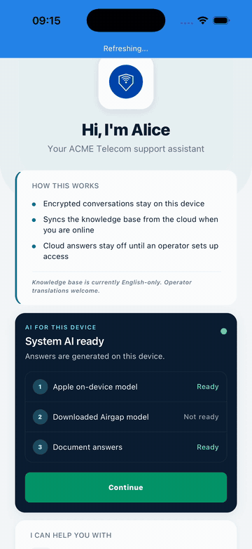
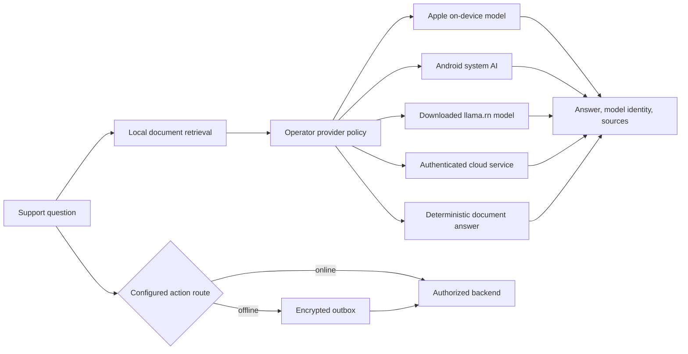

<p align="center">
  
</p>

<h1 align="center">Airgap</h1>

<p align="center">
  Offline-first customer support for React Native, with local knowledge, device AI, visible sources, and a recoverable action outbox.
</p>

<p align="center">
  <a href="https://github.com/xmpuspus/airgap/actions/workflows/ci.yml"></a>
  
  
</p>

Airgap is a starter kit for branded mobile support apps that must stay useful
when a network is slow, unavailable, or intentionally blocked. It retrieves
approved local documents first, then uses an operator-controlled answer provider
to phrase the result. Models do not supply company facts. The bundled documents
do.

The default demo makes no model request and needs no download. It lets a new
contributor check retrieval, citations, privacy status, and the interface before
choosing an inference provider or connecting a backend.



This GIF is a real iPhone 17 Pro Simulator run of the deterministic `demo`
provider. It is not physical-device proof of Apple Foundation Models. Exact
capture metadata is in [`demo/recordings.json`](demo/recordings.json).

## Get the first offline answer

Install Node.js 22.11 or newer, JDK 17, and Android SDK 36. Then run these
commands.

```bash
git clone https://github.com/xmpuspus/airgap.git && cd airgap
npm ci
npm run android
```

Choose **Try Offline Demo**, then tap a suggested question. This path needs no
model file or support service.

For iOS, install CocoaPods dependencies and run the checked `Airgap` scheme.

```bash
npm ci && bundle install
cd ios && bundle exec pod install && cd ..
npm run ios
```

Compile Apple Foundation Models support with Xcode 26 or newer. The
app still deploys to iOS 15.1 and reports the Apple provider as unavailable on
older or ineligible devices.

## One answer pipeline, five providers

Airgap routes every model-made answer through the same provider contract. Before each
request, Airgap reads the current device state, applies operator policy, and
tries permitted providers in priority order. Cancellation, failure reasons,
model identity, timing, and answer provenance use one result shape.

| Provider                | Runs where                                  | Data path               | Current state in this repository                            |
| ----------------------- | ------------------------------------------- | ----------------------- | ----------------------------------------------------------- |
| Apple on-device model   | iOS 26+, Apple Intelligence eligible device | On device               | Swift bridge, streaming, cancellation, readiness checks     |
| Android system AI       | Android API 26+, supported AICore device    | On device               | ML Kit Prompt API beta2 bridge, download, warmup, streaming |
| Downloaded Airgap model | iOS 15.1+ and Android API 24+               | On device               | `llama.rn`, pinned file size and SHA-256                    |
| Cloud service           | Either platform                             | Operator endpoint       | Off by default, needs policy and a fresh access token       |
| Document answers        | Either platform                             | Deterministic on device | Default demo provider, no model request                     |

[Apple Foundation Models](https://developer.apple.com/documentation/FoundationModels)
needs an Apple Intelligence-capable device. The Android code uses
[ML Kit GenAI Prompt API](https://developers.google.com/ml-kit/genai/prompt/android/get-started),
which needs API 26, a supported device, and an available or downloadable
Gemini Nano feature.

### Modes decide which chain is active

| Mode             | Selection rule                                                                 |
| ---------------- | ------------------------------------------------------------------------------ |
| `demo`           | Uses only `demo`, regardless of the configured production provider order       |
| `offline-only`   | Excludes cloud and tries permitted local providers in priority order           |
| `prefer-offline` | Uses the configured order, normally system model, downloaded model, then cloud |
| `prefer-online`  | Uses the configured order, normally cloud before local providers               |

The operator order takes precedence over a user routing preference. A busy,
unsupported, quota-limited, background-blocked, oversized, or failed provider
can fall through to the next permitted provider. Cancellation does not fall
through and cannot create a second answer.

### The interface explains four setup states

| State           | What the person sees                 | Next action                                       |
| --------------- | ------------------------------------ | ------------------------------------------------- |
| Ready           | Provider is available now            | Continue                                          |
| Download needed | The device can obtain the model      | Download, only when operator policy permits it    |
| Downloading     | Current model transfer progress      | Keep the app open                                 |
| Unavailable     | Plain reason and the remaining chain | Update, enable, or use another permitted provider |

Onboarding shows only the next useful action. Settings shows the complete
ordered chain, provider state, model identity, operating-system version, and
operator policy result.

## Operator policy is explicit

`airgap.config.json` controls platform, domain, locale, OS floor, model
downloads, cloud use, and provider priority.

```json
{
  "llm": {
    "mode": "offline-only",
    "supportDomain": "telco",
    "providers": [
      {
        "id": "apple-foundation-models",
        "enabled": true,
        "priority": 0,
        "platform": "ios",
        "minimumOsVersion": "26.0",
        "locales": ["en", "en-US"],
        "allowModelDownload": false,
        "allowCloudFallback": false
      },
      {
        "id": "llama-rn",
        "enabled": true,
        "priority": 10,
        "platform": "all",
        "allowModelDownload": true,
        "allowCloudFallback": false
      },
      {
        "id": "demo",
        "enabled": true,
        "priority": 30,
        "platform": "all"
      }
    ]
  }
}
```

Unknown IDs, duplicate providers, explicit platform conflicts, and an empty
enabled chain fail validation. The resolver enforces `minimumOsVersion` against
fresh device-state data. A downloadable Android system model is not offered when
`allowModelDownload` is false. For a cloud entry, `allowCloudFallback: false`
removes it from the chosen chain.

## What remains local

- Airgap searches local documents before generation.
- Apple, Android, downloaded-model, and demo answers keep prompt text and output
  on the device during inference.
- Conversations, the action outbox, user preferences, telemetry buffers, and
  other application state use separate encrypted MMKV stores. Their random keys
  live in the platform key store.
- Telemetry is off by default and does not include customer text by default.
- Cloud generation is off until an operator enables its provider, sets up
  the endpoint, and installs an access-token provider.

Android ML Kit processes prompts and outputs locally, but its terms state that
the APIs can contact Google for updated models, fixes, compatibility data, and
performance or usage metrics. Operators must show that in user notices and
store disclosures. See [ML Kit terms and privacy](https://developers.google.com/ml-kit/terms).

## Industry use depends on configuration and approval

The runtime can support offline FAQs, troubleshooting, policies, locations,
hours, eligibility guidance, and queued service requests across the seven
included industries. The examples show that the same code can load
different brands, prompts, actions, and documents.

| Industry         | Configuration and knowledge                                | Recorded example                                               |
| ---------------- | ---------------------------------------------------------- | -------------------------------------------------------------- |
| Airline          | [`examples/airline/`](examples/airline/)                   | [`demo/industry-airline.gif`](demo/industry-airline.gif)       |
| Banking          | [`examples/banking/`](examples/banking/)                   | [`demo/industry-banking.gif`](demo/industry-banking.gif)       |
| Electric utility | [`examples/electric-utility/`](examples/electric-utility/) | [`demo/industry-electric.gif`](demo/industry-electric.gif)     |
| Healthcare       | [`examples/healthcare/`](examples/healthcare/)             | [`demo/industry-healthcare.gif`](demo/industry-healthcare.gif) |
| Insurance        | [`examples/insurance/`](examples/insurance/)               | [`demo/industry-insurance.gif`](demo/industry-insurance.gif)   |
| Telecom          | [`examples/telco/`](examples/telco/)                       | [`demo/industry-telco.gif`](demo/industry-telco.gif)           |
| Water utility    | [`examples/water-utility/`](examples/water-utility/)       | [`demo/industry-water.gif`](demo/industry-water.gif)           |

An operator still owns document accuracy, identity, authorization, production
actions, escalation, retention, accessibility, legal review, and device fleet
testing. The examples are fixtures and do not certify industry use. In
particular,
Google's ML Kit GenAI terms prohibit clients directed to people under 18 and
prohibit clinical practice or medical advice. Review the
[GenAI terms](https://developers.google.com/ml-kit/genai-terms) before
enabling Android system AI.

## Architecture keeps models away from authority



Models phrase retrieved information. They do not choose tools, authenticate a
person, approve a sensitive action, or mutate an account. The deterministic
tool router and operator backend keep those responsibilities.

The main path starts in [`src/services/orchestrator.ts`](src/services/orchestrator.ts).
Provider choice lives in
[`src/services/inference/providerResolver.ts`](src/services/inference/providerResolver.ts),
and [`src/components/chat/AnswerProvenance.tsx`](src/components/chat/AnswerProvenance.tsx)
shows exact answer provenance.

## Evidence labels state the checked behavior

| Evidence                           | Target                  | Result                              | Unchecked behavior                            |
| ---------------------------------- | ----------------------- | ----------------------------------- | --------------------------------------------- |
| Fresh iOS demo GIF                 | iOS 26.4 simulator      | UI and answer checked               | Physical Apple model                          |
| iOS native compile                 | Generic iOS Simulator   | Foundation Models bridge compiles   | Eligible physical-device runtime              |
| Android debug compile              | Android app, min SDK 24 | ML Kit beta2 bridge compiles        | Supported AICore device runtime               |
| Existing Android and industry GIFs | Android 15 emulator     | Demo journeys and templates checked | Android system AI or physical-device behavior |

Every kept GIF records source commit, provider ID, model identity, device,
operating system, evidence class, capture command, dimensions, duration, byte
size, and loop review. Label simulator and emulator footage by its actual target,
never as a physical device. Run `npm run recordings:validate` to check all ten
assets.

## Current limits

- Physical-device evaluation for Apple Foundation Models and Android system AI
  is still a release gate.
- Android Prompt API is beta, foreground-only, quota-limited, device-limited,
  and restricted to inputs under 4,000 tokens.
- Apple and Android system model output can change after operating-system or
  model updates. Prompt and retrieval evaluation must run against each supported
  device and model identity.
- The downloaded model is about 2.4 GB. Its latency, memory use, and answer
  quality are device-dependent.
- The reference server uses an in-memory rate limiter. Production deployments
  need durable controls, monitoring, TLS termination, and real business systems.
- Airgap is not a hosted control plane, identity provider, account system, or
  claim of regulatory compliance.

## Documentation

- [`DEPLOYMENT.md`](DEPLOYMENT.md) covers native provider setup, signing, rollout, and rollback
- [`CUSTOMIZATION.md`](CUSTOMIZATION.md) covers brand, knowledge, actions, and configuration fields
- [`docs/hybrid-llm-design.md`](docs/hybrid-llm-design.md) explains provider routing and failure handling
- [`docs/sync-architecture.md`](docs/sync-architecture.md) explains signed knowledge updates
- [`docs/tool-calling.md`](docs/tool-calling.md) explains the deterministic action boundary
- [`SECURITY.md`](SECURITY.md) lists supported versions and private vulnerability reporting
- [`CONTRIBUTING.md`](CONTRIBUTING.md) gives the development and test workflow
- [`ROADMAP.md`](ROADMAP.md) lists release gates and planned work

Use [GitHub Issues](https://github.com/xmpuspus/airgap/issues) for reproducible
bugs and scoped feature requests. Report vulnerabilities through
[private vulnerability reporting](https://github.com/xmpuspus/airgap/security/advisories/new).

## License

Airgap is available under the [MIT License](LICENSE). Apple, Google, model files,
and connected services keep their own terms and licenses.
