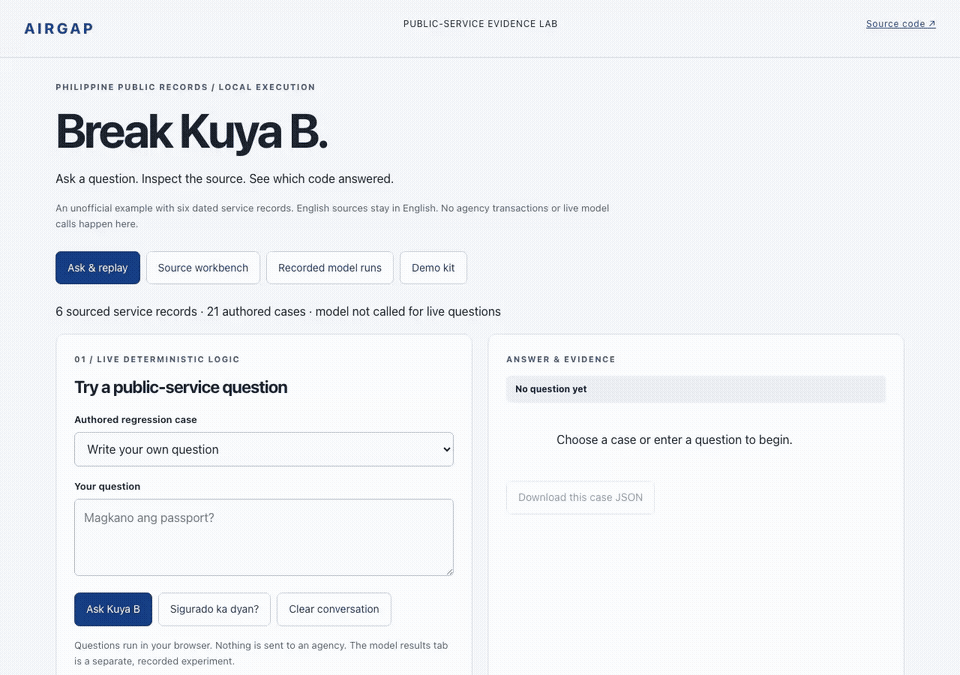
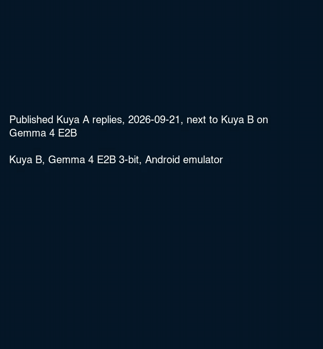
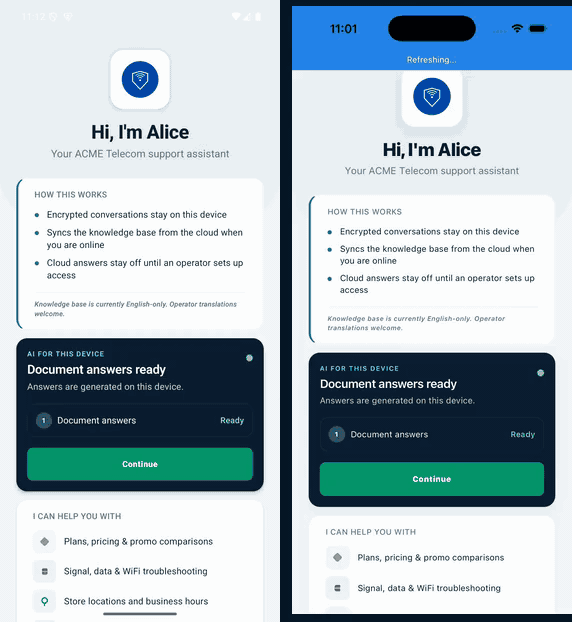
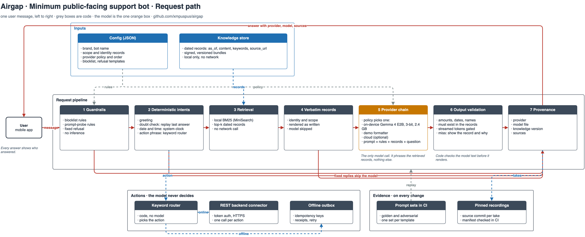
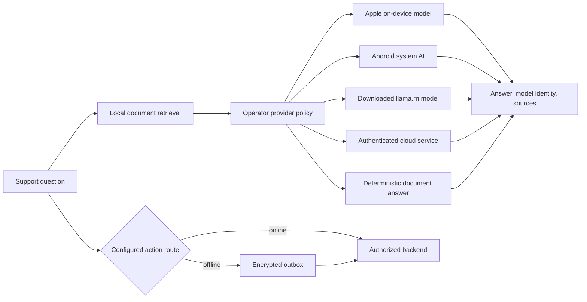

<p align="center">
  
</p>

<h1 align="center">Airgap</h1>

<p align="center">
  Offline-first customer support for React Native, with local knowledge, device AI, visible sources, and a recoverable action outbox.
</p>

<p align="center">
  <a href="https://github.com/xmpuspus/airgap/actions/workflows/ci.yml"></a>
  
  
</p>

Airgap is a starter kit for branded mobile support apps that must stay useful
when a network is slow, unavailable, or intentionally blocked. It retrieves
approved local documents first, then uses an operator-controlled answer provider
to phrase the result. Models do not supply company facts. The bundled documents
do.

The default demo makes no model request and needs no download. It lets a new
contributor check retrieval, citations, privacy status, and the interface before
choosing an inference provider or connecting a backend.

## Try the public-service Evidence Lab

The [local browser lab](web/lab.html) and CLI share the government mobile answer core.
They replay 21 authored cases, show exact source excerpts and hashes, and apply a real
historical holiday amendment. A separate tab exposes all outputs from the six-question,
three-repetition host-model comparison. Live browser questions call no model or agency.

```bash
npm ci
node scripts/public-service.mjs replay --json
npm run public:build
python3 -m http.server --bind 127.0.0.1 --directory web 8080
```

Use Node 22.18 or newer; open `http://127.0.0.1:8080/lab.html`.
The [reproduction guide](docs/public-service-showcase.md) covers first run, source review,
model limits and contributions. Each feature includes a GIF and MP4 derived from a real browser recording.
The [capture index](demo/public-service/README.md) links all five and their source hashes.

| Feature          | What you can try                                                       | Demo                                            |
| ---------------- | ---------------------------------------------------------------------- | ----------------------------------------------- |
| Replay Pack      | Run all 21 authored questions and inspect failures, routes and sources | [GIF](demo/public-service/replay-pack.gif)      |
| Evidence Lab     | Ask a question, challenge the answer and download its evidence         | [GIF](demo/public-service/evidence-lab.gif)     |
| Source Workbench | Apply the real 2024 holiday amendment, then roll it back               | [GIF](demo/public-service/source-workbench.gif) |
| Model Controls   | Compare raw local-model text with the answer the application displays  | [GIF](demo/public-service/model-controls.gif)   |
| Demo Kit         | Reproduce the experiment, browser checks and all five recordings       | [GIF](demo/public-service/demo-kit.gif)         |



The local model produced 12 incomplete responses in 36 calls. Every controlled answer
used a complete source record. Twelve of those fallbacks replaced already acceptable
model wording. [Read every output and the independent review](evidence/public-service/experiment-review.md).
These are CPU host measurements with Gemma 3. The older native recordings below have
their own source and model identities.



The left cards show the published replies of a national government app's assistant on its
2026-09-21 launch day. The right panel shows Kuya B, the `government-services` template, on the
same five prompts on an Android 15 emulator configured with a 3-bit Gemma 4 E2B file.
The first answer uses the model; the challenge, clock, identity and refusal are code paths.

The president answer comes from a dated record with a source line. In this older take, a
challenge repeats that answer. The
time comes from the device clock. The identity comes from configuration. A prompt probe gets a
fixed refusal from code. The
[case study](docs/case-study-government-assistant-launch.md) gives every source and the nine
controls behind the take.



This second GIF combines real Android 15 emulator and iPhone 17 Pro Simulator runs from
the same source commit. Both use the deterministic `demo` provider. The footage
does not prove Apple Foundation Models or Android system AI on a physical device.
Exact capture metadata is in [`demo/recordings.json`](demo/recordings.json).
The provider harness can also run controlled Apple and Android states through the native bridges
and visible app journey. Those runs are labeled simulated provider evidence and are separate from
the deterministic public GIFs.

## Get the first offline answer

Install Node.js 22.18 or newer, JDK 17, and Android SDK 36. Then run these
commands.

```bash
git clone https://github.com/xmpuspus/airgap.git && cd airgap
npm ci
npm run android
```

Choose **Try Offline Demo**, then tap a suggested question. This path needs no
model file or support service.

To create a branded telco starting point without cloning the full repository,
use the published scaffolder.

```bash
npx create-airgap-bot support-app --template telco
cd support-app
npm install
npm run android
```

For iOS, install CocoaPods dependencies and run the checked `Airgap` scheme.

```bash
npm ci && bundle install
cd ios && bundle exec pod install && cd ..
npm run ios
```

Compile Apple Foundation Models support with Xcode 26 or newer. The
app still deploys to iOS 15.1 and reports the Apple provider as unavailable on
older or ineligible devices.

## The minimum architecture for a public-facing support bot

The diagram below is the whole request path for one user message. Code owns every
control point. The model only phrases retrieved records. The nine controls behind it
are in [`docs/support-bot-minimum.md`](docs/support-bot-minimum.md).
[`docs/diagrams/build_minimum_support_bot.py`](docs/diagrams/build_minimum_support_bot.py)
writes the draw.io source and the PNG.



<details>
<summary>Text version of the diagram</summary>

```text
INPUTS
  Config (JSON)     brand, bot identity, scope, provider policy, blocklist,
                    refusal templates
  Knowledge store   dated records {as_of, content, keywords, source_url},
                    signed and versioned bundles

REQUEST PIPELINE  (per user message, in this order)
  1. Guardrails           blocklist + prompt-probe rules -> fixed refusal,
     (code)               no inference
  2. Deterministic        greeting; "sigurado ka dyan?" -> replay the last
     intents (code)       record-backed answer; date/time -> system clock;
                          action phrases -> keyword router
  3. Retrieval (local)    BM25 over the knowledge store -> top-k dated records
  4. Verbatim records     identity and scope records render as written,
                          model skipped
  5. Provider chain       policy picks one: on-device model (Gemma 4 E2B)
     (model phrases only) | demo formatter | optional cloud
                          prompt = rules + retrieved records + question
  6. Output validation    every amount, date, and name in the answer must
     (code, before render) exist in the records; streamed tokens are gated;
                          on a miss -> show the record and say why
  7. Provenance           provider, model file, knowledge version, and
                          sources shown on the answer

ACTIONS  (the model never decides)
  keyword router -> REST backend connector | offline outbox with
  idempotency keys and receipts

EVIDENCE
  template fixtures and retrieval assertions in CI
  public-service CLI executes government answer/route assertions in CI
  recordings pinned to their source commit; manifest validated in CI
```

## One answer pipeline, five providers

Airgap routes every model-made answer through the same provider contract. Before each
request, Airgap reads the current device state, applies operator policy, and
tries permitted providers in priority order. Cancellation, failure reasons,
model identity, timing, and answer provenance use one result shape.

| Provider                | Runs where                                  | Data path               | Current state in this repository                            |
| ----------------------- | ------------------------------------------- | ----------------------- | ----------------------------------------------------------- |
| Apple on-device model   | iOS 26+, Apple Intelligence eligible device | On device               | Swift bridge, streaming, cancellation, readiness checks     |
| Android system AI       | Android API 26+, supported AICore device    | On device               | ML Kit Prompt API beta2 bridge, download, warmup, streaming |
| Downloaded Airgap model | iOS 15.1+ and Android API 24+               | On device               | `llama.rn`, pinned file size and SHA-256                    |
| Cloud service           | Either platform                             | Operator endpoint       | Off by default, needs policy and a fresh access token       |
| Document answers        | Either platform                             | Deterministic on device | Default demo provider, no model request                     |

[Apple Foundation Models](https://developer.apple.com/documentation/FoundationModels)
needs an Apple Intelligence-capable device. The Android code uses
[ML Kit GenAI Prompt API](https://developers.google.com/ml-kit/genai/prompt/android/get-started),
which needs API 26, a supported device, and an available or downloadable
Gemini Nano feature.

### Modes decide which chain is active

| Mode             | Selection rule                                                                 |
| ---------------- | ------------------------------------------------------------------------------ |
| `demo`           | Uses only `demo`, regardless of the configured production provider order       |
| `offline-only`   | Excludes cloud and tries permitted local providers in priority order           |
| `prefer-offline` | Uses the configured order, normally system model, downloaded model, then cloud |
| `prefer-online`  | Uses the configured order, normally cloud before local providers               |

The operator order takes precedence over a user routing preference. A busy,
unsupported, quota-limited, background-blocked, oversized, or failed provider
can fall through to the next permitted provider. Cancellation does not fall
through and cannot create a second answer.

### The interface explains four setup states

| State           | What the person sees                 | Next action                                       |
| --------------- | ------------------------------------ | ------------------------------------------------- |
| Ready           | Provider is available now            | Continue                                          |
| Download needed | The device can obtain the model      | Download, only when operator policy permits it    |
| Downloading     | Current model transfer progress      | Keep the app open                                 |
| Unavailable     | Plain reason and the remaining chain | Update, enable, or use another permitted provider |

Onboarding shows only the next useful action. Settings shows the complete
ordered chain, provider state, model identity, operating-system version, and
operator policy result.

## Operator policy is explicit

`airgap.config.json` controls platform, domain, locale, OS floor, model
downloads, cloud use, and provider priority.

```json
{
  "llm": {
    "mode": "offline-only",
    "supportDomain": "telco",
    "providers": [
      {
        "id": "apple-foundation-models",
        "enabled": true,
        "priority": 0,
        "platform": "ios",
        "minimumOsVersion": "26.0",
        "locales": ["en", "en-US"],
        "allowModelDownload": false,
        "allowCloudFallback": false
      },
      {
        "id": "llama-rn",
        "enabled": true,
        "priority": 10,
        "platform": "all",
        "allowModelDownload": true,
        "allowCloudFallback": false
      },
      {
        "id": "demo",
        "enabled": true,
        "priority": 30,
        "platform": "all"
      }
    ]
  }
}
```

Unknown IDs, duplicate providers, explicit platform conflicts, and an empty
enabled chain fail validation. The resolver enforces `minimumOsVersion` against
fresh device-state data. A downloadable Android system model is not offered when
`allowModelDownload` is false. For a cloud entry, `allowCloudFallback: false`
removes it from the chosen chain.

## What remains local

- Airgap searches local documents before generation.
- Apple, Android, downloaded-model, and demo answers keep prompt text and output
  on the device during inference.
- Conversations, the action outbox, user preferences, telemetry buffers, and
  other application state use separate encrypted MMKV stores. Their random keys
  live in the platform key store.
- Telemetry is off by default and does not include customer text by default.
- Cloud generation is off until an operator enables its provider, sets up
  the endpoint, and installs an access-token provider.

Android ML Kit processes prompts and outputs locally, but its terms state that
the APIs can contact Google for updated models, fixes, compatibility data, and
performance or usage metrics. Operators must show that in user notices and
store disclosures. See [ML Kit terms and privacy](https://developers.google.com/ml-kit/terms).

## Industry use depends on configuration and approval

The runtime can support offline FAQs, troubleshooting, policies, locations,
hours, eligibility guidance, and queued service requests across the eight
included industries. The examples show that the same code can load
different brands, prompts, actions, and documents.

| Industry            | Configuration and knowledge                                      | Recorded example                                                                                                                                                                                                                                 |
| ------------------- | ---------------------------------------------------------------- | ------------------------------------------------------------------------------------------------------------------------------------------------------------------------------------------------------------------------------------------------ |
| Airline             | [`examples/airline/`](examples/airline/)                         | [`demo/industry-airline.gif`](demo/industry-airline.gif)                                                                                                                                                                                         |
| Banking             | [`examples/banking/`](examples/banking/)                         | [`demo/industry-banking.gif`](demo/industry-banking.gif)                                                                                                                                                                                         |
| Electric utility    | [`examples/electric-utility/`](examples/electric-utility/)       | [`demo/industry-electric.gif`](demo/industry-electric.gif)                                                                                                                                                                                       |
| Government services | [`examples/government-services/`](examples/government-services/) | [`demo/industry-government.gif`](demo/industry-government.gif), [`demo/airgap-showcase-government.gif`](demo/airgap-showcase-government.gif), and [`demo/airgap-showcase-government-services.gif`](demo/airgap-showcase-government-services.gif) |
| Healthcare          | [`examples/healthcare/`](examples/healthcare/)                   | [`demo/industry-healthcare.gif`](demo/industry-healthcare.gif)                                                                                                                                                                                   |
| Insurance           | [`examples/insurance/`](examples/insurance/)                     | [`demo/industry-insurance.gif`](demo/industry-insurance.gif)                                                                                                                                                                                     |
| Telecom             | [`examples/telco/`](examples/telco/)                             | [`demo/industry-telco.gif`](demo/industry-telco.gif)                                                                                                                                                                                             |
| Water utility       | [`examples/water-utility/`](examples/water-utility/)             | [`demo/industry-water.gif`](demo/industry-water.gif)                                                                                                                                                                                             |

An operator still owns document accuracy, identity, authorization, production
actions, escalation, retention, accessibility, legal review, and device fleet
testing. The examples are fixtures and do not certify industry use. In
particular,
Google's ML Kit GenAI terms prohibit clients directed to people under 18 and
prohibit clinical practice or medical advice. Review the
[GenAI terms](https://developers.google.com/ml-kit/genai-terms) before
enabling Android system AI.

## Architecture keeps models away from authority


```mermaid
flowchart LR
    Q[Support question] --> R[Local document retrieval]
    R --> P[Operator provider policy]
    P --> A[Apple on-device model]
    P --> G[Android system AI]
    P --> L[Downloaded llama.rn model]
    P --> C[Authenticated cloud service]
    P --> D[Deterministic document answer]
    A --> V[Answer, model identity, sources]
    G --> V
    L --> V
    C --> V
    D --> V
    Q --> T{Configured action route}
    T -->|online| B[Authorized backend]
    T -->|offline| O[Encrypted outbox]
    O --> B
```

Models phrase retrieved information. They do not choose tools, authenticate a
person, approve a sensitive action, or mutate an account. The deterministic
tool router and operator backend keep those responsibilities.

The main path starts in [`src/services/orchestrator.ts`](src/services/orchestrator.ts).
The provider policy is in
[`src/services/inference/providerResolver.ts`](src/services/inference/providerResolver.ts),
and [`src/components/chat/AnswerProvenance.tsx`](src/components/chat/AnswerProvenance.tsx)
shows exact answer provenance.

## Evidence labels state the checked behavior

| Evidence                  | Target                                   | Result                                                          | Unchecked behavior                                 |
| ------------------------- | ---------------------------------------- | --------------------------------------------------------------- | -------------------------------------------------- |
| Joint and iOS GIFs        | Android 15 emulator + iOS 26.4 simulator | Readiness, UI, and cited answers                                | Physical native providers                          |
| Fresh Android GIF         | Android 15 emulator                      | Answer, queue, Outbox, and privacy checked                      | Android system AI or physical-device behavior      |
| Eight industry GIFs       | Android 15 emulator                      | Fixture-specific onboarding, answer, and sources checked        | Production data, actions, approvals, or compliance |
| iOS native compile        | Generic iOS Simulator                    | Foundation Models bridge compiles                               | Eligible physical-device runtime                   |
| Android debug compile     | Android app, min SDK 24                  | ML Kit beta2 bridge compiles                                    | Supported AICore device runtime                    |
| iOS provider scenario     | iOS 26.4 simulator                       | Native bridge, routing, answer, provenance, and UI              | Apple model output or physical-device behavior     |
| Android provider scenario | Android 15 emulator                      | Native bridge, routing, answer, provenance, and UI              | AICore or Gemini Nano model output                 |
| Gemma 4 E2B takes         | Android 15 emulator                      | Four takes of ten, six, and five prompts on the on-device model | Phone speed, repeated runs, or production data     |
| Apple host probe          | Apple-silicon Mac, macOS 26              | Framework and environment availability                          | iPhone behavior; AI must be enabled by the owner   |

Every kept app GIF records source commit, provider ID, model identity, device,
operating system, evidence class, capture command, dimensions, duration, byte
size, public playback speed, and loop review. `demo/kb-studio.gif` is a terminal
recording of the KB Studio tool and has no manifest entry. Label simulator and emulator footage
by its actual target, never as a physical device. Run `npm run recordings:validate`
to check all sixteen assets.

Provider reports add a separate class for what generated the answer:
`deterministic-runtime`, `simulated-provider`, `host-native-model`, `virtual-device-model`, or
`target-device`. Run
`npm run providers:validate` to check the scenario manifest, or follow
[`docs/provider-validation.md`](docs/provider-validation.md) to run the full app scenario, Apple
host probe, physical-device preflight, and optional downloaded-model placement.

## Current limits

- Physical-device evaluation for Apple Foundation Models and Android system AI
  is still a release gate.
- Android Prompt API is beta, foreground-only, quota-limited, device-limited,
  and restricted to inputs under 4,000 tokens.
- Apple and Android system model output can change after operating-system or
  model updates. Prompt and retrieval evaluation must run against each supported
  device and model identity.
- The downloaded model is about 2.45 GB (2.28 GiB). Its latency, memory use, and answer
  quality are device-dependent.
- The reference server uses an in-memory rate limiter. Production deployments
  need durable controls, monitoring, TLS termination, and real business systems.
- Airgap is not a hosted control plane, identity provider, account system, or
  claim of regulatory compliance.

## Documentation

- [`docs/README.md`](docs/README.md) routes operators, app developers, backend developers, and maintainers to the right guide
- [`DEPLOYMENT.md`](DEPLOYMENT.md) covers native provider setup, signing, rollout, and rollback
- [`CUSTOMIZATION.md`](CUSTOMIZATION.md) covers brand, knowledge, actions, and configuration fields
- [`docs/enterprise-integration.md`](docs/enterprise-integration.md) covers identity, API, sync, and production boundaries
- [`docs/hybrid-llm-design.md`](docs/hybrid-llm-design.md) explains provider routing and failure handling
- [`docs/sync-architecture.md`](docs/sync-architecture.md) explains signed knowledge updates
- [`docs/tool-calling.md`](docs/tool-calling.md) explains the deterministic action boundary
- [`docs/safety-layer.md`](docs/safety-layer.md) explains safety checks and their limits
- [`docs/support-bot-minimum.md`](docs/support-bot-minimum.md) lists the nine controls any support bot needs before the model matters
- [`docs/case-study-government-assistant-launch.md`](docs/case-study-government-assistant-launch.md) replays one public launch failure against those controls
- [`docs/observability.md`](docs/observability.md) lists diagnostics, telemetry fields, and privacy limits
- [`docs/kb-studio.md`](docs/kb-studio.md) covers local knowledge authoring and validation
- [`docs/recordings.md`](docs/recordings.md) gives the reproducible media evidence process
- [`docs/provider-validation.md`](docs/provider-validation.md) explains provider scenarios, host and device checks, and evidence labels
- [`SECURITY.md`](SECURITY.md) lists supported versions and private vulnerability reporting
- [`SUPPORT.md`](SUPPORT.md) explains how to report a reproducible problem
- [`CONTRIBUTING.md`](CONTRIBUTING.md) gives the development and test workflow
- [`ROADMAP.md`](ROADMAP.md) lists release gates and planned work

Use [GitHub Issues](https://github.com/xmpuspus/airgap/issues) for reproducible
bugs and scoped feature requests. Report vulnerabilities through
[private vulnerability reporting](https://github.com/xmpuspus/airgap/security/advisories/new)
after the maintainer enables it in the repository settings.

## License

Airgap is available under the [MIT License](LICENSE). Apple, Google, model files,
and connected services keep their own terms and licenses.
