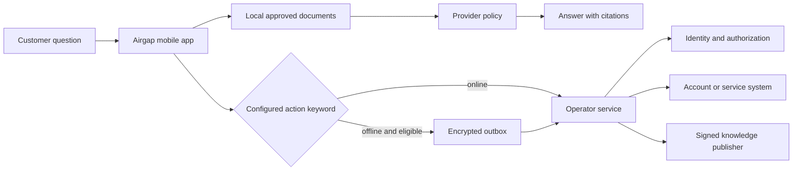

# Connect Airgap to operator systems

Airgap keeps local answers and remote account actions on separate paths. The mobile app can answer
from approved documents while offline. Identity, account data, and state-changing work stay behind
an operator service.

## The repository defines the mobile contracts

| Area                  | Included here                                     | Operator work                                      |
| --------------------- | ------------------------------------------------- | -------------------------------------------------- |
| Local support content | Bundled documents, search, citations, signed sync | Content ownership, publishing, expiry, translation |
| Identity              | Async access-token provider interface             | Login, token issuer, audience, revocation          |
| Account actions       | Mock and REST connector interfaces, outbox        | Authorization, APIs, idempotency, audit            |
| Cloud generation      | Authenticated request client and fallback policy  | Model service, filtering, retention, cost controls |
| Telemetry             | Bounded client events and a reference file sink   | Durable storage, access rules, monitoring          |
| Operations            | Health route and deterministic release checks     | TLS, scaling, backup, incident response, support   |

The included Node server handles signed knowledge delivery, model metadata, telemetry intake,
health, authentication, body limits, and one-process rate limiting. It does not contain account
lookups, customer authentication, or production action routes.

## Runtime flow

The model provider receives retrieved document text only after Airgap applies the operator policy.
The tool router chooses known methods before generation. The backend must make every authorization
decision again.

## Mobile REST contract

`RestBackendConnector` calls these routes.

| Method | Route                           | Mobile expectation                  |
| ------ | ------------------------------- | ----------------------------------- |
| `GET`  | `/api/v1/accounts/{id}/balance` | Current account summary             |
| `POST` | `/api/v1/accounts/{id}/plan`    | Idempotent plan request             |
| `POST` | `/api/v1/tickets`               | Idempotent ticket request           |
| `GET`  | `/api/v1/outages`               | Outage status, optional location    |
| `POST` | `/api/v1/actions/{type}`        | Operator-defined action             |
| `GET`  | `/api/v1/sync/kb`               | Signed knowledge manifest           |
| `GET`  | Manifest download URL           | Exact signed knowledge bytes        |
| `GET`  | `/api/v1/sync/model`            | Downloaded-model release metadata   |
| `POST` | `/api/v1/telemetry`             | Bounded event batch                 |
| `POST` | `/api/v1/llm/generate`          | Optional authenticated cloud answer |

Every protected call asks the installed token provider for a fresh token. REST endpoints need
HTTPS. State-changing calls include an `Idempotency-Key` header when the outbox supplies one.

The reference server in [`server/`](../server/) handles only the sync, model, telemetry, and
health routes. Add account and action routes in an operator-owned service or replace
`BackendConnector` with a domain adapter.

## Identity and authorization

Install an access-token provider during application startup. The provider receives the set
audience and returns a short-lived token. Do not store a client secret or long-lived bearer value in
the app configuration.

The operator service must complete these checks.

1. Check token signature, issuer, audience, expiry, and revocation state.
2. Map the caller to an account through operator-owned identity rules.
3. Authorize the exact resource and action.
4. Check all request fields without trusting model output.
5. Enforce idempotency for retries.
6. write an audit record that excludes secrets and unnecessary customer text.

Airgap does not ship a generic login screen because identity flows and recovery rules differ by
operator and industry.

## Signed knowledge publishing

The server returns a manifest that names the bundle version, URL, length, SHA-256 digest, signing
key ID, and Ed25519 signature. The app downloads the exact bytes, checks every field, checks the
document schema, and swaps the local bundle only after all checks pass.

Keep the private signing key in an operator key service. Pin only raw public keys in the app. Plan a
release window where old and new public keys overlap before removing the old key.

See [`sync-architecture.md`](sync-architecture.md) for the byte-level protocol.

## Offline actions

Only set-up state-changing tools with `offlineQueueEligible: true` enter the outbox. The app
shows a receipt, retry state, and removal control. Connectivity starts a retry, but the server still
owns authorization and idempotency.

Do not queue an operation when delay changes its meaning, safety, price, or consent. Examples
include emergency dispatch, market orders, prescription approval, and one-time authentication.

## Cloud generation

Cloud generation is off by default. To enable it, the operator must set an allowed routing mode,
enable the `cloud` provider, set an HTTPS endpoint or backend base URL, and install an access-token
provider for the cloud audience.

The request has the system prompt, retrieved document context, token limit, and temperature.
Treat this as customer-data processing. Define retention, region, vendor, incident, deletion, and
fallback rules before use.

## Production acceptance checks

- Run offline cold start and cited local answers with the operator bundle.
- Reject expired tokens, wrong audiences, unauthorized accounts, and changed request fields.
- Replay each state-changing request and check that the backend applies one effect.
- Alter one byte in a knowledge bundle and check that the app keeps the last valid version.
- Test key rotation with both keys, then with the old key removed.
- Stop the cloud service and check the listed local fallback.
- Check outbox behavior across restart, reconnect, duplicate response, and permanent failure.
- Review logs and telemetry for customer text, tokens, account data, and retention.

Use [`DEPLOYMENT.md`](../DEPLOYMENT.md) for the full mobile release checklist and
[`server/README.md`](../server/README.md) for the reference process.
