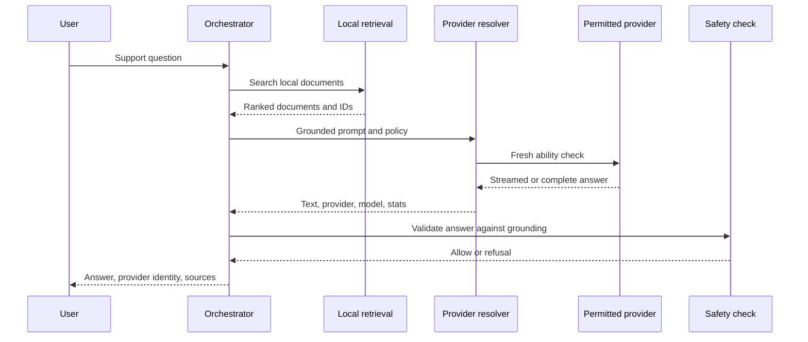

# Provider routing and hybrid generation

Airgap separates support facts, answer phrasing, and business authority.

- Local retrieval supplies approved support facts.
- One permitted provider phrases those facts.
- The deterministic router chooses tools and actions.
- The backend authenticates, authorizes, and applies account changes.

A model never becomes the source of company policy and never gains authority to
change an account.

## Shared provider contract

Five provider IDs use one TypeScript contract.

- `apple-foundation-models`
- `android-aicore`
- `llama-rn`
- `cloud`
- `demo`

Each provider reports fresh ability data and supports generation,
cancellation, and last-run statistics. A completed result includes provider ID,
model identity, locality, and available timing or token facts.

The resolver normalizes these failure reasons.

- `unsupported_device`
- `unsupported_os`
- `unsupported_locale`
- `provider_disabled`
- `model_not_ready`
- `download_required`
- `busy`
- `quota_exceeded`
- `background_blocked`
- `context_exceeded`
- `generation_failed`
- `cancelled`

Every reason except cancellation can move to the next permitted provider.
Cancellation ends the request. The resolver rejects a second concurrent
request to the same provider.

## Policy is evaluated before generation

`config.llm.providers` lists entries in ascending priority. The resolver applies
these checks.

1. enabled state
2. target platform
3. allowed and blocked support domains
4. locale allowlist
5. operating mode
6. cloud permission
7. current provider ability
8. least OS version

The provider readiness interface enforces model download permission. A
downloadable Android model becomes unavailable to setup when policy does not
allow a download.

The default public config lists platform system AI first, the downloaded model
second, cloud third but disabled, and deterministic document answers last. It
sets `llm.mode` to `demo`, so only the deterministic provider runs until an
operator changes the mode.

## Operating modes

### `demo`

The resolver chooses only `demo`. It formats retrieved documents with
`document-formatter-v1` and makes no model request. This mode checks retrieval,
answer layout, citations, and recording journeys without a model file.

### `offline-only`

The resolver excludes cloud even when an operator enables it. It tries permitted
local providers in the set priority order. Use this when customer prompt text must
not go to a generation service.

### `prefer-offline`

The resolver follows the set priority, which normally places platform system
AI or `llama-rn` before an enabled cloud entry. Cloud runs only if policy permits
it and all earlier permitted providers fail or report unavailable.

### `prefer-online`

The resolver still follows the set priority. To make this mode cloud-first,
give the cloud entry a lower priority number than local providers. If cloud is
offline, unconfigured, unauthorized, or unsuccessful, a later local provider
can answer.

The explicit provider list is authoritative. The mode does not silently reorder
an operator's entries.

## Retrieval happens before provider choice

The orchestrator follows this sequence for an informational question.



This sequence limits a model to retrieved document content. An output check can
refuse unsupported amounts or other ungrounded content. The visible answer card
keeps source document IDs and exact provider identity.

## Tool and action path stays separate

The deterministic tool router runs before document generation. A successful
tool returns structured backend data. A permitted provider can phrase that data,
but the output check compares the response with the tool result.

State-changing actions stay with the backend. If an action needs a
network and the device is offline, the encrypted outbox stores a request with an
idempotency key. A model does not decide whether to queue, retry, authorize, or
remove that request.

## Platform provider behavior

### Apple on-device model

The Swift module uses `SystemLanguageModel.default` on iOS 26 or newer. It checks
Apple Intelligence eligibility, enablement, model readiness, and locale before
creating a session. A new `LanguageModelSession` receives the system instructions
for each request. Stream snapshots become text deltas for React Native.

The module reports current OS, context size, and a stable OS-based model label.
It maps unsupported locale, context overflow, concurrent requests, rate limits,
and cancellation to shared reasons. Older or ineligible devices fall through
without importing the framework at runtime.

Apple manages and updates the system model. Quality evidence must include OS,
device, model identity, prompt version, knowledge version, and app commit. See
[Apple Foundation Models](https://developer.apple.com/documentation/FoundationModels).

### Android system AI

The Kotlin module uses ML Kit GenAI Prompt API `1.0.0-beta2`. It keeps the base
app base at API 24 but returns `unsupported_os` before ML Kit initialization
on API 24 or 25.

On API 26 or newer, the module checks feature status, streams model download
progress, warms the model, counts prompt tokens, streams output, and supports
cancellation. It rejects a joint instructions and document prompt at 4,000
tokens or above and reserves output capacity below the model token limit.

AICore can report busy, battery quota, background use, download, preparation,
and unsupported-device failures. The app maps those results to the common
fallback contract. Google's current device list and restrictions are in the
[ML Kit GenAI overview](https://developers.google.com/ml-kit/genai) and
[Prompt API setup guide](https://developers.google.com/ml-kit/genai/prompt/android/get-started).

## Cloud endpoint contract

The cloud provider sends one authenticated request.

```http
POST /api/v1/llm/generate
Content-Type: application/json
Authorization: Bearer <fresh access token>

{
  "system": "string",
  "user": "string",
  "maxTokens": 512,
  "temperature": 0.3
}
```

A successful endpoint returns this shape.

```json
{
  "text": "string",
  "model": "optional provider model identity",
  "latencyMs": 125
}
```

The app gets a fresh token from the installed access-token provider. It does not
store a bearer token or OAuth client secret in mobile configuration. The request
has a 30-second timeout. The current cloud adapter returns a complete response.
It does not expose transport streaming or cancellation.

## Cloud response cache

The cloud service caches a response for 30 minutes with a 100-entry in-memory
cap. The key hashes system prompt, user message, and knowledge version when
`cacheByKbVersion` is true, so a knowledge update produces a new key.

The cache clears on process restart. It is not a durable knowledge store and
does not make a cloud answer available after an offline restart.

## Privacy and telemetry

Provider locality is part of every generation result. Apple, Android,
`llama-rn`, and `demo` are local. `cloud` is remote.

Airgap does not send customer prompt text to telemetry by default. Operational
events can keep provider ID, model identity, latency, token count, failure
reason, source IDs, and confidence. Operators must review logs, crash reporting,
connected services, and platform model terms before making a privacy claim.

ML Kit says it processes prompt input and output on-device, while the APIs
can contact Google for models, fixes, compatibility data, and metrics. See
[ML Kit privacy terms](https://developers.google.com/ml-kit/terms).

## Evaluation and rollback

Evaluate each provider with the same approved question set and documents. Record
these results.

- exact physical device or simulator/emulator class
- OS and system-model identity
- app commit, configuration, prompt pack, and knowledge version
- answer, citations, refusal result, and fallback reason
- time to first token, total time, token count, memory, and thermal state
- foreground, background, cancellation, quota, and long-context behavior

System-model results expire when the OS or model identity changes.

Rollback is a provider policy change. Set `enabled` to false, publish the normal
controlled app or configuration update, and check that Settings shows the provider
as off by policy. Keep alternative providers available until the rollback is
checked on a target device.
